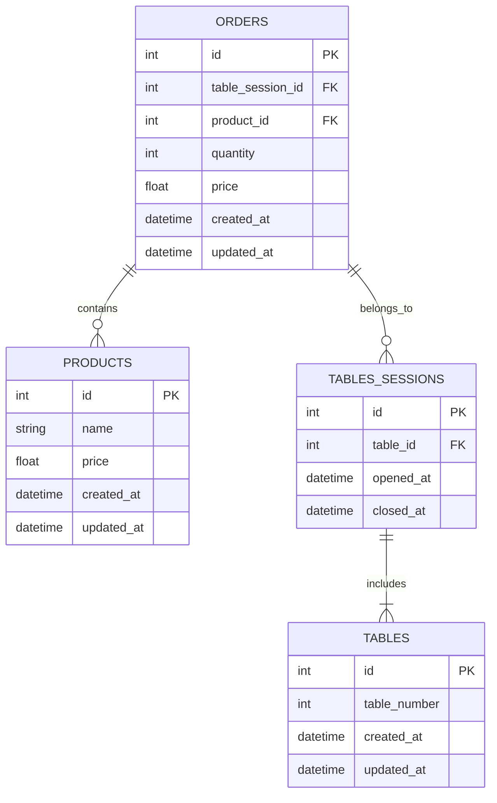

# Projeto Restaurant Orders API

**Restaurant Orders API** é uma aplicação RESTful para gerenciar pedidos de mesas em um restaurante. O sistema permite criar, visualizar, atualizar e excluir produtos, além de consultar produtos disponíveis para compor os pedidos.

## Tecnologias Utilizadas
<p>
	
	
	
	
	
	
  <a href="https://wakatime.com/badge/user/30563c84-4568-4594-9bbe-b31f0effd26b/project/537b4bb1-a3d8-41c1-a2bd-d55a6ffd0f79">
    
  </a>
</p>

## Diagrama ER



## Funcionalidades
- **Gerenciamento de Mesas:** Criação, atualização e fechamento de mesas, incluindo o controle de sessões ativas de mesas.

- **CRUD de Pedidos:** Criar, visualizar e calcular o total de pedidos feitos em uma mesa durante uma sessão.

- **CRUD de Produtos:** Adição, atualização, remoção e busca de produtos no cardápio.

- **Validação de Dados:** Verificação e validação de dados de entrada usando Zod.

- **Banco de Dados:** Migrações e seeds para criar e popular tabelas, como products, orders, tables e table_sessions.

- **Tratamento de Erros:** Middleware customizado para captura e tratamento de erros durante o uso da API.

- **Sessões de Mesas:** Abertura de sessão ao chegar no restaurante, inclusão de pedidos durante a sessão e encerramento ao fechar a conta.

## Requisitos

- Node.js (versão mínima 18.x.x)

## Instalação

1. Clonar o Repositório

```bash
git clone https://github.com/anaclaraaraujo/api-restaurant
```

2. Acessar o Diretório do Projeto

```bash
cd api-restaurant
```

3. Instalar Dependências

```bash
npm install
```

4. Configurar o Banco de Dados

```bash
npm run knex -- migrate:latest
```

5. Popular o Banco de Dados (Opcional)

```bash
npm run knex -- seed:run
```

6. Inicializar o Servidor

```bash
npm run dev
```

O servidor será iniciado na porta 3333 e a API estará disponível para consumo.

# Licença

Este projeto está licenciado sob a [LICENSE](LICENSE).